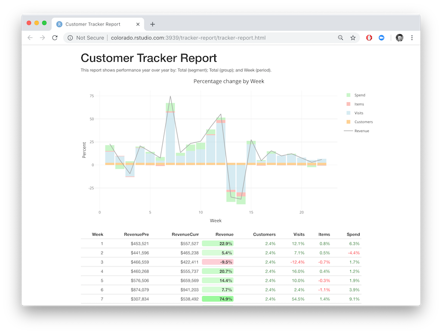

# Customer Tracker

Turn your R code into reports, presentations, dashboards, apps, and API's with [R Markdown](https://rmarkdown.rstudio.com/), [Shiny](http://shiny.rstudio.com/), and [Plumber](https://www.rplumber.io/). This repos shows 9 different data products built on the same data set. Use whatever output type is appropriate for your situation. After you create your content, you can publish it to [RStudio Connect](https://www.rstudio.com/products/connect/).

## Data Explanation

These reports show year over year performance for many customer segments and product groups. Top level performance (i.e. revenue) is decomposed into lower level performance metrics (i.e. customer visits, items purchased, and checkout spend). For example, in week 1 revenue for the all segments and products increased by 22.9 compared to last year. The main contributors to the increase were visits (+12.1%) and spend (+6.3%).

## Output Types 

The following output formats for the customer tracker are hosted on [RStudio Connect](https://www.rstudio.com/products/connect/):

#### Reports

* [HTML Report](http://colorado.rstudio.com/rsc/tracker-report/tracker-report.html) <small>[[login]](http://colorado.rstudio.com:3939/connect/#/apps/1609/access)</small>
* [PDF Report](http://colorado.rstudio.com:3939/content/1644/tracker-pdf.pdf) <small>[[login]](http://colorado.rstudio.com:3939/connect/#/apps/1644/access) </small>
* [Word Report](http://colorado.rstudio.com:3939/content/1643/) <small>[[login]](http://colorado.rstudio.com:3939/connect/#/apps/1643/access/1432) </small>

#### Presentations

* [HTML Presentation](http://colorado.rstudio.com:3939/content/1645/tracker-ioslides.html) <small>[[login]](http://colorado.rstudio.com:3939/connect/#/apps/1645/access/1229)</small>
* [PowerPoint Presentation](http://colorado.rstudio.com:3939/content/1646/) <small>[[login]](http://colorado.rstudio.com:3939/connect/#/apps/1646/access/1429)</small>

#### Shiny apps and docs

* [Shiny App](http://colorado.rstudio.com:3939/tracker-app/) <small>[[login]](http://colorado.rstudio.com:3939/connect/#/apps/1120)</small>
* [Shiny Document](http://colorado.rstudio.com:3939/content/1121/) <small>[[login]](http://colorado.rstudio.com:3939/connect/#/apps/1121/access)</small>
* [Flexdashboard](http://colorado.rstudio.com:3939/content/1642/) <small>[[login]](http://colorado.rstudio.com:3939/connect/#/apps/1642/access)</small>

#### API's

* [Plumber API](http://colorado.rstudio.com:3939/content/1117/) <small>[[login]](http://colorado.rstudio.com:3939/connect/#/apps/1117/access)</small>

## RStudio Connect 

[RStudio Connect](https://www.rstudio.com/products/connect/) is a server product from RStudio for secure sharing of R content. It is on-premises software you run behind your firewall. You keep control of your data and who has access. With RStudio Connect you can see all your content, decide who should be able to view and collaborate on it, tune performance, schedule updates, and view logs.

## References 

* [Communicating Results with R Markdown](https://rviews.rstudio.com/2018/11/01/r-markdown-a-better-approach/)
* [Enterprise Dashboards with R Markdown](https://rviews.rstudio.com/2018/05/16/replacing-excel-reports-with-r-markdown-and-shiny/)
* [Enterprise Dashboards with Shiny and Databases](https://rviews.rstudio.com/2017/09/20/dashboards-with-r-and-databases/)

