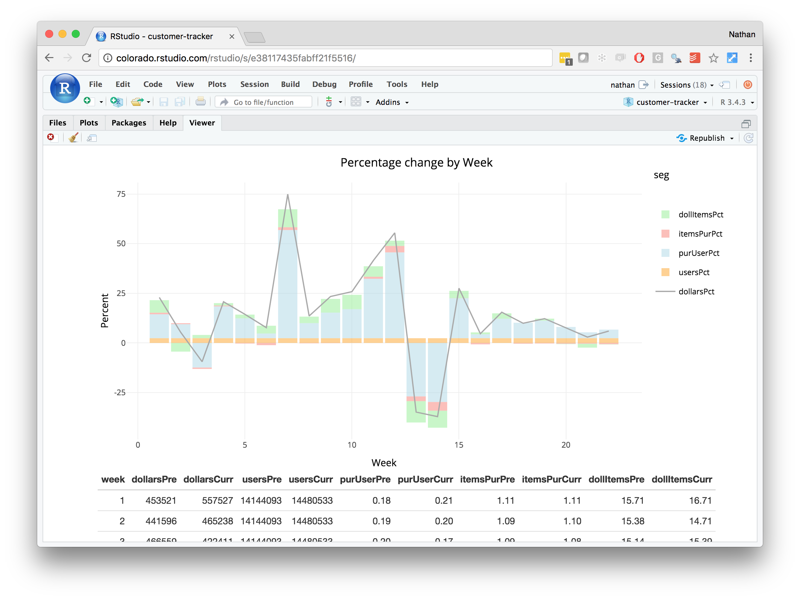

# Customer tracker

These dashboards and reports track key performance metrics for customers by week. Users can interact with these reports in order to pull the precise data they are looking for. Read more about the customer tracker on [R Views](https://rviews.rstudio.com/2018/05/16/replacing-excel-reports-with-r-markdown-and-shiny/) or or view the code on [Github](https://github.com/sol-eng/customer-tracker).

## Published Output Types 

You can create your content with these open source R packages like [R Markdown](https://rmarkdown.rstudio.com/), [Shiny](http://shiny.rstudio.com/), or [Plumber](https://www.rplumber.io/). After you create your content, you can publish it to [RStudio Connect](https://beta.rstudioconnect.com/connect/). It is easy to turn your R code into reports, dashboards, apps, and API's. The following output formats for the customer tracker are hosted on [RStudio Connect](https://beta.rstudioconnect.com/connect/):

#### Reports

* [HTML Report](http://colorado.rstudio.com/rsc/tracker-report/tracker-report.html) <small>[[login]](http://colorado.rstudio.com:3939/connect/#/apps/1095/access)</small>
* [PDF Report](http://colorado.rstudio.com:3939/content/1109/tracker-pdf.pdf) <small>[[login]](http://colorado.rstudio.com:3939/connect/#/apps/1109/access) </small>
* [Word Report](http://colorado.rstudio.com:3939/content/1247/vcoWkF5eS/) <small>[[login]](http://colorado.rstudio.com:3939/connect/#/apps/1247/access/1432) </small>

#### Presentations

* [HTML Presentation](http://colorado.rstudio.com:3939/content/1110/tracker-ioslides.html) <small>[[login]](http://colorado.rstudio.com:3939/connect/#/apps/1110/access/1229)</small>
* [PowerPoint Presentation](http://colorado.rstudio.com:3939/content/1246/vMEHUS5Ks/) <small>[[login]](http://colorado.rstudio.com:3939/connect/#/apps/1246/access/1429)</small>

#### Interactive docs and apps

* [Interactive Document](http://colorado.rstudio.com:3939/content/1121/) <small>[[login]](http://colorado.rstudio.com:3939/connect/#/apps/1121/access)</small>
* [Flexdashboard](http://colorado.rstudio.com:3939/content/1094/) <small>[[login]](http://colorado.rstudio.com:3939/connect/#/apps/1094/access)</small>
* [Shiny App](http://colorado.rstudio.com:3939/content/1120/) <small>[[login]](http://colorado.rstudio.com:3939/connect/#/apps/1120)</small>

#### API's

* [Plumber API](http://colorado.rstudio.com:3939/content/1117/) <small>[[login]](http://colorado.rstudio.com:3939/connect/#/apps/1117/access)</small>

## RStudio Connect 

[RStudio Connect](https://beta.rstudioconnect.com/connect/) is a server product from RStudio for secure sharing of R content. It is on-premises software you run behind your firewall. You keep control of your data and who has access. With RStudio Connect you can see all your content, decide who should be able to view and collaborate on it, tune performance, schedule updates, and view logs.

